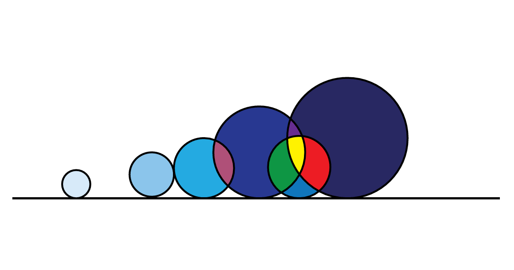



## Machine Learning with Imbalanced Data - Code Repository

**Launched**: November, 2020

Actively maintained.

## Links

- [Online Course](https://www.trainindata.com/p/machine-learning-with-imbalanced-data)

## Table of Contents

1. **Metrics**
	1. Limitations of the Accuracy
	2. Precision, Recall, F-Measure
	3. Confusion Matrix
	4. False Positive Rate and False Negative Rate
	5. Geometric Mean
	6. Dominance
	7. Index of imbalanced accuracy
	8. ROC-AUC
	9. Precision-Recall Curves
	10. Probability Distribution and Calibration
	11. Which metric to optimise

2. **Udersampling Methods**
	1. Random Undersampling
	2. Condensed Nearest Neighbour
    3. Tomek Links
    4. One Sided Selection
	5. Edited Nearest Neighbours
	6. Repeated Edited Nearest Neighbours
	7. All KNN
	8. Neighbourhood Cleaning Rule    
	9. NearMiss
	10. Instance Hardness Threshold

3. **Oversampling methods**
	1. Random Oversampling
	2. ADASYN
	3. SMOTE
	4. BorderlineSMOTE
	5. KMeansSMOTE
	6. SMOTENC
	7. SVMSMOTE

4. **Over and Undersampling Methods**
	1. SMOTENN
	2. SMOTETomek

5. **Ensemble Methods**
	1. Coming Soon

6. **Cost Sensitive Learning**
	1. Types of cost
	2. Obtaining the Cost
	3. Missclassification Cost
	4. Bayes Risk
	5. MetaCost

7. **Probability Calibration**
	1. Probability Calibration Curves
	2. Brier Score
	3. Effect of under and over sampling on Probability Calibration
	4. Cost Sensitive Learning and Probability Calibration
	4. Calibrating a Classifier

## Links

- [Online Course](https://www.trainindata.com/p/machine-learning-with-imbalanced-data)